

[comment]: 

**UNIVERSIDAD PRIVADA DE TACNA**

**FACULTAD DE INGENIERIA**

**Escuela Profesional de Ingeniería de Sistemas**

**Proyecto *“Control de Asistencia”***

Curso: *Calidad y Pruebas de Software*

Docente: *Ing. Cuadros Quiroga, Patrick Jose*

Integrantes:

***
Paja De la Cruz, Piero Alexander			(2020067576)

Contreras Lipa, Alvaro Javier 			(2021070020)

Hernández Cruz, Angel Gadiel		 	(2021070017)
***

**Tacna – Perú**

***2024***

**  
**

\pagebreak

Sistema *{Nombre del Sistema}*

Informe de Factibilidad

Versión *{1.0}*

|CONTROL DE VERSIONES||||||
| :-: | :- | :- | :- | :- | :- |
|Versión|Hecha por|Revisada por|Aprobada por|Fecha|Motivo|
|1\.0|MPV|ELV|ARV|10/10/2020|Versión Original|

\pagebreak

# **INDICE GENERAL**

Resumen

Abstract

[1. Antecedentes](#_Toc52661346)

[2. Titulo](#_Toc52661347)

[3. Autores](#_Toc52661348)

[4. Planteamiento del problema](#_Toc52661349)

[4.1 Problema](#_Toc52661350)

[4.2 Justificación](#_Toc52661351)

[4.3 Alcance](#_Toc52661352)

[5. Objetivos](#_Toc52661356)

[5.1 General](#_Toc52661350)

[5.2 Especificos](#_Toc52661351)

[6. Referentes teóricos](#_Toc52661357)

[7. Desarrollo de la propuesta](#_Toc52661356)

[7.1 Tecnología de información ](#_Toc52661350)

[7.2 Metodología, técnicas usadas](#_Toc52661351)

[7. Cronograma](#_Toc52661356)

\pagebreak

**<u>Tema: Control de Asistencia</u>**

1. **Antecedentes o introducción**

    Cuando el usuario ingresa sus datos para iniciar sesión en la interfaz del sistema de control de asistencia, se le asignará un rol según su nivel de relevancia dentro del sistema (por ejemplo, usuario común, administrador, supervisor). Esta información se almacenará en una base de datos creada anteriormente, asegurando que los nombres de usuario y contraseñas sean únicos. 

2. **Titulo**

    Control Asistencia

3. **Autores**

* Contreras Lipa, Alvaro Javier
* Hernandez Cruz, Angel Gadiel
* Paja De la Cruz, Piero Alexander

4. **Planteamiento del problema**

    4.1. Problema

    La problemática que motiva la implementación de la codificación en el sistema de control de asistencia es la privacidad de los usuarios. La protección de datos como el DNI, número telefónico e incluso los nombres genera preocupación, por lo que se optó por codificar toda la información. De esta manera, solo podrán acceder a los datos aquellos que estén autorizados y tengan una relación directa con el empleado registrado.

    4.2. Justificación

    La implementación de la codificación en el sistema de control de asistencia se justifica principalmente para proteger la privacidad de los usuarios, asegurando que datos sensibles como el DNI, número telefónico y nombres estén resguardados. Esta medida responde a la necesidad de prevenir el acceso no autorizado y posibles usos indebidos de la información personal, garantizando que solo personas directamente relacionadas con el empleado registrado puedan acceder a estos datos. De este modo, se preserva la confidencialidad y se cumple con las normativas de protección de datos personales, evitando controversias y posibles daños a los individuos involucrados.

    4.3. Alcance

    El alcance principal del sistema está limitado únicamente a personas autorizadas que cuenten con un usuario registrado, garantizando así que no haya divulgación o filtración de información.

5. **Objetivos**

    5.1. General

    El objetivo principal es un diseño minimalista que proporcione un ambiente amigable, permitiendo al usuario acceder y utilizar el sistema con facilidad, así como ingresar o encontrar rápidamente los datos necesarios.

    5.2. Especifico
   
    * Evitar la vulneración de contraseñas mediante ataques de diccionario.
    * Prevenir la exposición de datos personales.
    * Facilitar la navegación en relación con los usuarios registrados.

6. **Referentes teóricos**
    Diagramas de Casos de Uso, Diagrama de Clases, Diagrama de Componentes y Arquitectura.

**REQUERIMIENTOS FUNCIONALES**

- **RF1**: Autenticación: El sistema debe permitir el inicio de sesión mediante un nombre de usuario y contraseña. **(Prioridad: Alta)**
- **RF2**: Validación de Usuario: El sistema debe verificar la validez del usuario y contraseña utilizando un procedimiento almacenado. **(Prioridad: Alta)**
- **RF3**: Gestión de Empleados: El sistema debe permitir agregar, modificar y eliminar empleados. **(Prioridad: Alta)**
- **RF4**: Visualización de Empleados: El sistema debe listar todos los empleados registrados en un DataGridView. **(Prioridad: Alta)**
- **RF5**: Marcar Asistencia: El sistema debe permitir marcar la asistencia de un empleado usando su nombre y DNI. **(Prioridad: Alta)**
- **RF6**: Listado de Asistencias: El sistema debe mostrar las asistencias marcadas por día. **(Prioridad: Alta)**
- **RF7**: Obtener Faltas: El sistema debe permitir obtener las faltas de los empleados. **(Prioridad: Media)**
- **RF8**: Configuración de Áreas y Puestos: El sistema debe permitir seleccionar áreas y puestos desde un combo box. **(Prioridad: Media)**
- **RF9**: Interacción de UI: El sistema debe proporcionar retroalimentación visual (ej. cambio de color al pasar el mouse) para mejorar la experiencia del usuario. **(Prioridad: Media)**
- **RF10**: Limpiar Campos: El sistema debe permitir limpiar los campos de entrada después de realizar una acción. **(Prioridad: Media)**

**DEFINICIÓN, SIGLAS Y ABREVIATURAS**

**Definiciones:**
- **LOGIN**: Proceso de autenticación para usuarios y administradores en el sistema.
- **FrmAsistencias**: Formulario para marcar y gestionar la asistencia de los empleados.
- **FrmEmpleado**: Formulario dedicado a la gestión de información de los empleados, incluyendo agregar, modificar y eliminar registros.
- **FrmEstadisticas**: Formulario que muestra estadísticas relacionadas con la asistencia de los empleados.
- **FrmInicio**: Pantalla principal del sistema que ofrece acceso a diferentes funcionalidades y opciones.
- **FrmLista**: Formulario que muestra una lista de empleados registrados y permite la selección para ver detalles o realizar acciones.

**Siglas y Abreviaturas:**
- **UI (User Interface)**: Interfaz de usuario que debe ser intuitiva y fácil de usar.
- **DB (Database)**: Base de datos utilizada por el sistema para almacenar información de los empleados y sus asistencias.
- **CRUD (Create, Read, Update, Delete)**: Conjunto de operaciones básicas para la gestión de datos en la base de datos.

**DIAGRAMA DE PAQUETES**

**DIAGRAMA ENTIDAD-RELACIÓN**

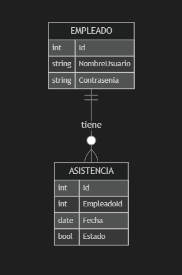

**DIAGRAMA DE CLASES**

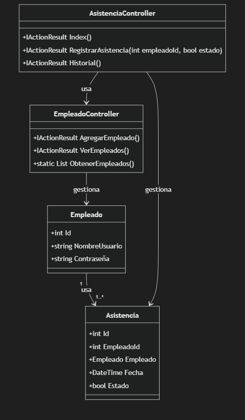

**DIAGRAMA DE SECUENCIA**

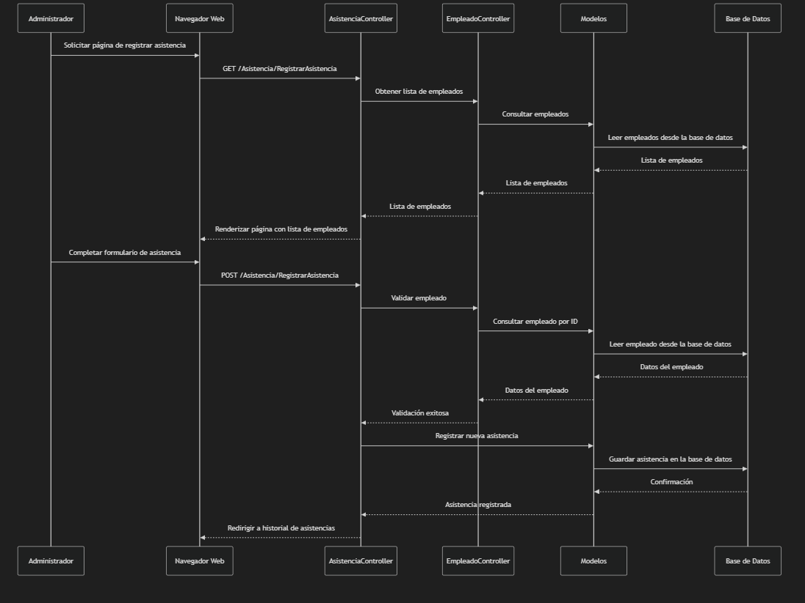

**DIAGRAMA DE CASOS DE USO**

**DIAGRAMA DE COMPONENTES**

**DIAGRAMA DE DESPLIEGUE**

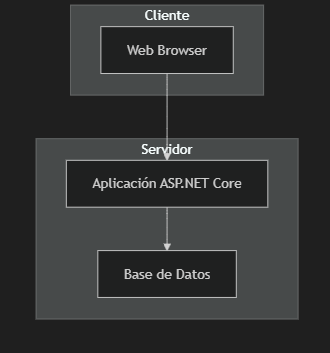

7. Desarrollo de la propuesta 

SONARCLOUD

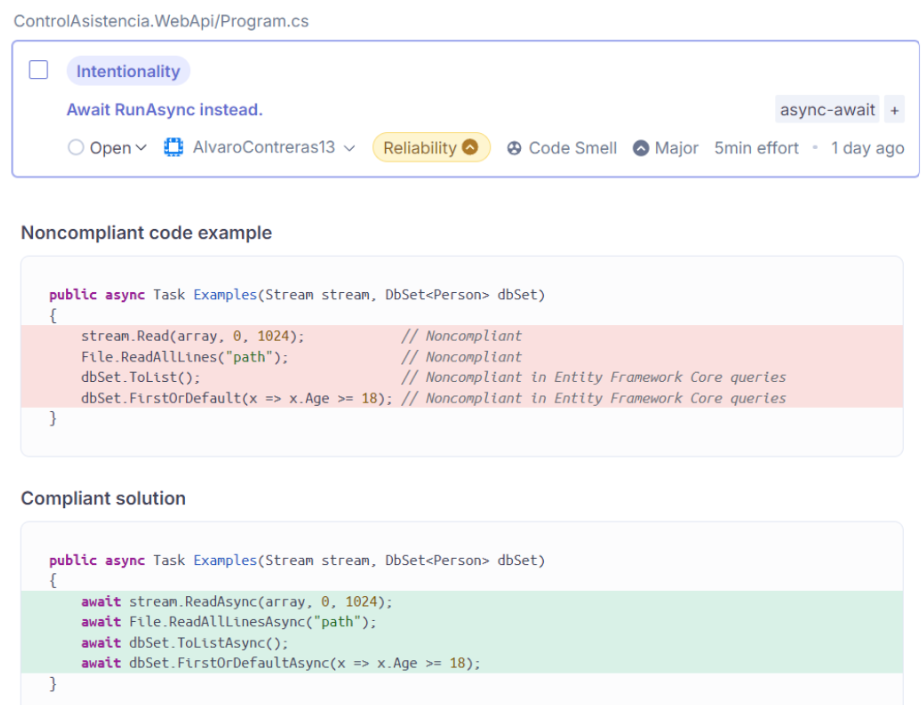

Versión Corregida (Con soporte asincrónico):

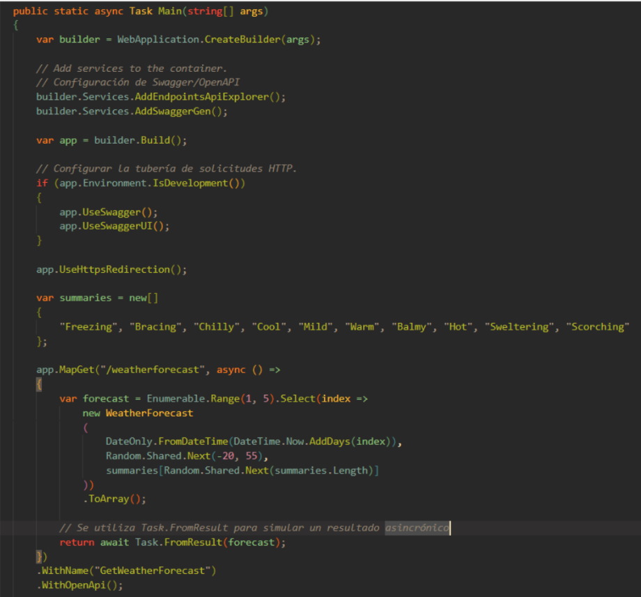

**Descripción de los cambios:**

**Cambio de Run() a RunAsync():**

* En el código antiguo, el método app.Run() se utilizaba de manera sincrónica, lo que no es eficiente para aplicaciones que manejan múltiples solicitudes concurrentes. Ahora, se usa await app.RunAsync() para permitir que la aplicación se ejecute de forma asincrónica, mejorando la capacidad de respuesta de la aplicación.

**Método principal async Task Main:**

* El método principal se ha modificado para ser asincrónico, utilizando async Task Main en lugar de solo void Main. Esto permite el uso de await en el código principal del programa, lo que es necesario para las operaciones asincrónicas.

**Uso de Task.FromResult en el endpoint:**

* El uso de Task.FromResult con await es un patrón que prepara la aplicación para operaciones asincrónicas en endpoints. Aún si el resultado es inmediato, este enfoque permite evitar bloqueos y manejar de forma efectiva operaciones de larga duración, mejorando el rendimiento de la aplicación al escalar con múltiples solicitudes concurrentes. 

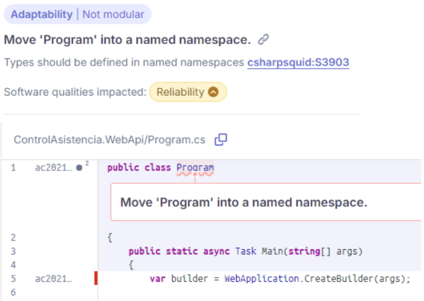

Código Corregido:

**Descripción de los cambios:**

**Añadido de un Espacio de Nombres (namespace):**

* Se añadió la declaración namespace ControlAsistencia para encapsular la clase Program. 

**Imports Necesarios:**

* Se han añadido las declaraciones using para importar los namespaces de Microsoft.AspNetCore.Builder y Microsoft.Extensions.DependencyInjection, que son necesarios para el funcionamiento del código.

 

**Move 'Program' into a named namespace**

**Código Corregido:**

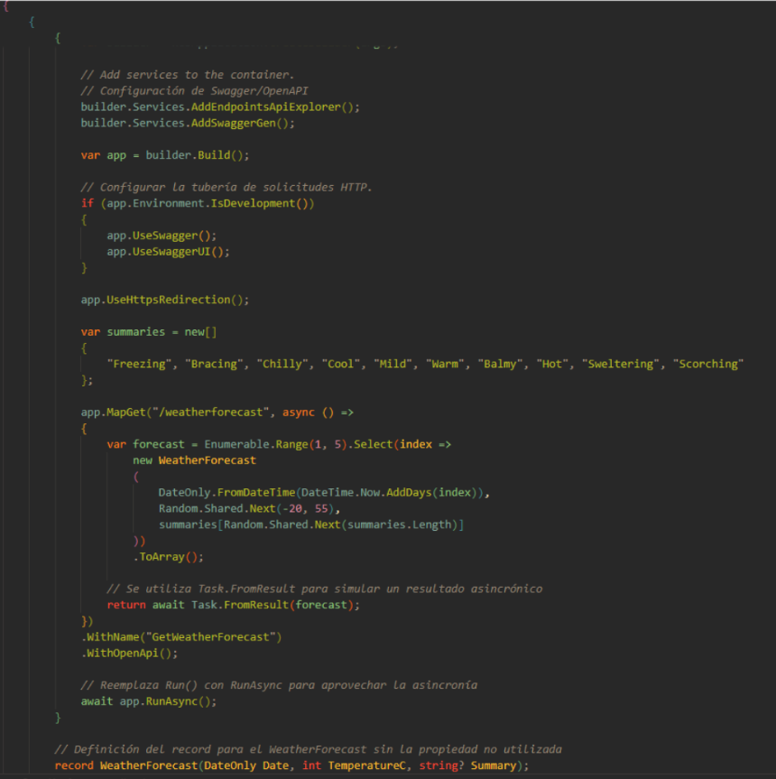

**Descripción de los cambios:** 

* Eliminación de TemperatureF: Se ha removido la propiedad TemperatureF del record WeatherForecast, ya que no se utilizaba en el código. Esto ayuda a reducir la complejidad y mejora la mantenibilidad del código.

 

**Snyk:**

no se encontraron errores en el código

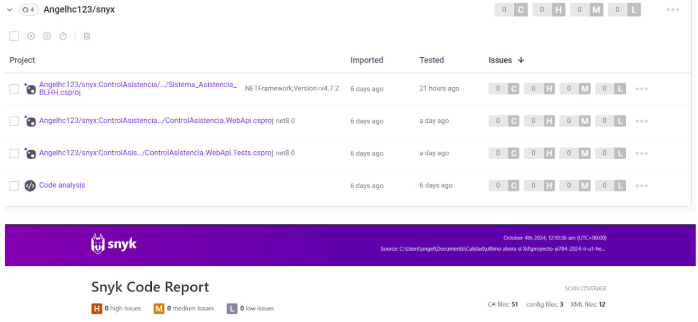

## **Reporte de Cobertura de Pruebas Unitarias**

El objetivo del reporte de cobertura es evaluar qué porcentaje del código fuente ha sido ejecutado durante las pruebas automatizadas, ayudando a identificar áreas no probadas, garantizar la calidad del software, fomentar pruebas más exhaustivas y guiar el mantenimiento del código. Proporciona métricas claras para medir el progreso de las pruebas y priorizar esfuerzos en áreas críticas, reduciendo el riesgo de errores y asegurando que el software sea más robusto y confiable.

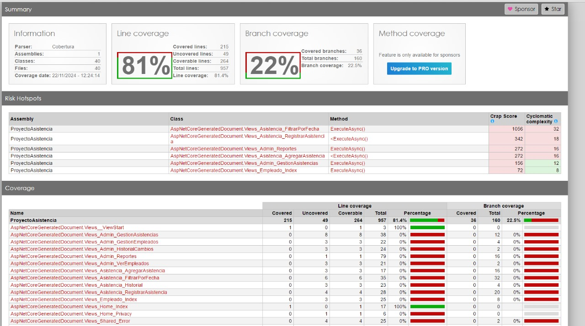
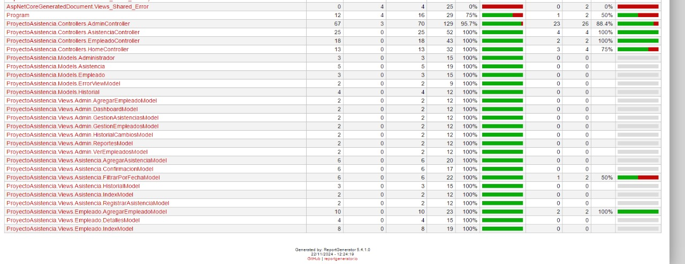

### **Tests Creados**

1. HomeControllerTests.cs
* Objetivo: Verificar las funcionalidades clave del controlador HomeController.
* Cobertura de pruebas:
    * Método Error: Asegura que el método Error retorna un ViewResult con un modelo de tipo ErrorViewModel y valida el TraceIdentifier proporcionado.
    * Validación del modelo: Comprueba que el modelo del resultado tiene los datos esperados, lo cual confirma que el controlador procesa correctamente los errores.

2. AdminControllerTests.cs
* Objetivo: Probar las funcionalidades principales del controlador AdminController, incluyendo la gestión de empleados, asistencias, historial de cambios y reportes.
* Cobertura de pruebas:
    * Dashboard: Valida que los datos en ViewBag (total de empleados, asistencias, presentes, ausentes) se calculan correctamente en diferentes escenarios.
    * Gestión de empleados y asistencias: Comprueba que las vistas GestionEmpleados y GestionAsistencias cargan las listas adecuadas de empleados y asistencias respectivamente.
    * AgregarEmpleado: Verifica tanto los casos válidos como inválidos de agregar un empleado.
    * Reportes: Asegura que los datos de asistencia por mes, presentes y ausentes son calculados y mostrados correctamente.

3. AsistenciaControllerTests.cs
* Objetivo: Validar las acciones del controlador AsistenciaController relacionadas con la gestión de asistencias e historial.
* Cobertura de pruebas:
    * Métodos Index e Historial: Verifica que retornan correctamente una vista.
    * Registrar asistencia: Comprueba que el registro de asistencia (tanto con solicitudes GET como POST) funciona correctamente y retorna los resultados esperados.
    * Setup: Asegura que el controlador se inicializa correctamente.

4. EmpleadoControllerTests.cs
*   Objetivo: Validar las funcionalidades del controlador EmpleadoController, especialmente en la gestión de empleados.
*   Cobertura de pruebas:
    * AgregarEmpleado: Valida tanto los casos de éxito como los errores en el registro de empleados (por ejemplo, cuando el modelo es inválido).
    * VerEmpleados: Comprueba que la lista de empleados se carga correctamente.
    * Actualización de la lista: Asegura que, tras agregar un empleado, la lista se actualiza adecuadamente y refleja los cambios esperados.

5. AsistenciaControllerTests2.cs
* Objetivo: Validar funcionalidades adicionales del controlador AsistenciaController relacionadas con el manejo de asistencias y vistas complementarias.
* Cobertura de pruebas:
    * Index: Comprueba que el método retorna una vista con el modelo esperado de tipo List<Asistencia>.
    * RegistrarAsistencia (GET): Valida que se retorna una vista con la lista de empleados en el ViewData.
    * RegistrarAsistencia (POST):
        * Caso exitoso: Verifica que una asistencia se agrega correctamente cuando el empleado existe, redirigiendo al método Historial.
        * Caso fallido: Valida que retorna un BadRequest con un mensaje adecuado cuando el empleado no es encontrado.
    * Historial: Asegura que retorna una vista con un modelo de tipo List<Asistencia>.

1. Administrador.Tests.cs
* Objetivo: Evaluar las funcionalidades principales del modelo Administrador, verificando que sus propiedades se comporten correctamente y cumplan con las reglas de validación.
* Cobertura de pruebas:
    * Propiedades: Se verifican los métodos de acceso (get y set) de las propiedades del modelo Administrador.
    * Validación: Asegura que los datos cumplen con las restricciones definidas en las anotaciones de validación.
    * Caso inválido: Prueba un escenario en el que una propiedad requerida no está configurada, validando que el modelo no sea válido.

1. Administrador.Tests.cs
* Objetivo: Evaluar las funcionalidades principales del modelo Administrador, verificando que sus propiedades se comporten correctamente y cumplan con las reglas de validación.
* Cobertura de pruebas:
Propiedades: Se verifican los métodos de acceso (get y set) de las propiedades del modelo Administrador.
Validación: Asegura que los datos cumplen con las restricciones definidas en las anotaciones de validación.
Caso inválido: Prueba un escenario en el que una propiedad requerida no está configurada, validando que el modelo no sea válido.

2. Asistencia.Tests.cs
* Objetivo: Validar la integridad y el comportamiento del modelo Asistencia, asegurando la correcta gestión de sus propiedades y su cumplimiento con las reglas de validación.
* Cobertura de pruebas:
    * Asignación de Propiedades: Verifica que las propiedades como Id, EmpleadoId, Empleado, Fecha y Estado se asignen y se obtengan correctamente.
    * Validación Exitosa: Comprueba que el modelo es válido cuando todas las propiedades requeridas están configuradas adecuadamente.
    * Caso Inválido: Valida que el modelo sea inválido cuando una propiedad requerida como Empleado es nula y revisa los mensajes de error generados.

3. ErrorViewModelTests.cs
* Objetivo: Evaluar el comportamiento de la propiedad ShowRequestId del modelo ErrorViewModel.
* Cobertura de pruebas:
    * Caso Nulo: Verifica que ShowRequestId devuelve false cuando RequestId es nulo.
    * Caso Vacío: Confirma que ShowRequestId retorna false cuando RequestId está vacío.
    * Caso Válido: Asegura que ShowRequestId devuelve true cuando RequestId contiene un valor válido.

1. AdminViewTest.cs
* Objetivo: Validar el correcto funcionamiento de las vistas relacionadas con la administración en el proyecto.
* Cobertura de pruebas:
    * AgregarEmpleadoModel: Verifica que la página se carga sin lanzar excepciones.
    * DashboardModel: Valida que la vista del dashboard se cargue correctamente.
    * GestionAsistenciasModel: Asegura que la lista de asistencias se gestione correctamente y simula datos para verificar la funcionalidad.
    * GestionEmpleadosModel: Comprueba la correcta carga de la vista de gestión de empleados.
    * HistorialCambiosModel: Valida la funcionalidad de historial de cambios y su manejo cuando no hay datos.
    * ReportesModel: Verifica que la vista de reportes se cargue sin errores.
    * VerEmpleadosModel: Comprueba que la lista de empleados se muestre correctamente en la vista y su manejo cuando no hay datos.

2. AsistenciaViewTest.cs
* Objetivo: Validar las vistas relacionadas con la gestión de asistencias en el proyecto.
* Cobertura de pruebas:
    * AgregarAsistenciaModel: Comprueba que la vista de agregar asistencia se cargue correctamente y valida la funcionalidad para agregar datos.
    * FiltrarPorFechaModel: Valida que la funcionalidad de filtrado por fecha en la vista opere sin errores.
    * HistorialModel: Asegura que la vista del historial se carga correctamente.
    * ConfirmacionModel: Verifica que la página de confirmación funcione correctamente, incluyendo la simulación de éxito en la operación.

3. EmpleadoViewTest.cs
* Objetivo: Garantizar que las vistas relacionadas con los empleados funcionen correctamente.
* Cobertura de pruebas:
    * AgregarEmpleadoModel: Valida que la vista se cargue y que los empleados puedan ser añadidos correctamente.
    * DetallesModel: Comprueba que los detalles de un empleado se carguen correctamente.
    * IndexModel: Valida que la lista de empleados se cargue correctamente en la vista de índice y simula datos para verificar el conteo y contenido.

4. HomeViewTest.cs
* Objetivo: Validar las funcionalidades principales de las vistas de inicio y privacidad.
* Cobertura de pruebas:
    * Index: Comprueba que el método Index devuelve un resultado de tipo ViewResult.
    * Privacy: Verifica que el método Privacy también devuelve un resultado de tipo ViewResult.

5. ErrorViewModelTests.cs
* Objetivo: Validar la funcionalidad del modelo ErrorViewModel en la gestión de identificadores de solicitud (RequestId).
* Cobertura de pruebas:
    * ShowRequestId (true): Comprueba que ShowRequestId retorna verdadero cuando RequestId no es nulo ni vacío.
    * ShowRequestId (false): Valida que ShowRequestId retorna falso cuando RequestId es nulo o vacío.

6. IndexModelTests.cs
* Objetivo: Validar el correcto funcionamiento de la página de inicio (Index) del módulo de asistencia.
* Cobertura de pruebas:
    * OnGet: Verifica que la ejecución del método OnGet no genera excepciones.

7. RegistrarAsistenciaModelTests.cs
* Objetivo: Asegurar que el modelo de la vista para registrar asistencias opera correctamente.
* Cobertura de pruebas:
    * OnGet: Valida que el método OnGet no arroje excepciones durante su ejecución.

## **SONAR CLOUD - Reporte de cobertura**

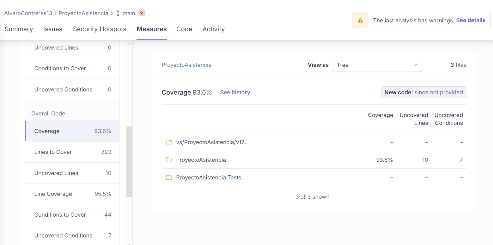

La cobertura de código en SonarCloud es una métrica clave que evalúa qué porcentaje del código de un proyecto está siendo probado mediante pruebas automatizadas. Este análisis permite identificar las partes del código que no han sido ejecutadas durante los tests, ayudando a mejorar la calidad del software al reducir errores no detectados.

* Cobertura General (Coverage):
Se alcanzó un 93.6% de cobertura general, lo que indica que la mayoría del código está siendo verificado mediante pruebas automatizadas.
Existen 10 líneas y 7 condiciones no cubiertas, lo que podría representar áreas del código que aún no han sido probadas.
* Line Coverage:
Específicamente, las líneas de código tienen una cobertura del 95.5%, lo que significa que casi todas las líneas han sido evaluadas en las pruebas.

Referencias:

* Juanjo. (2022, September 20). Qué es SonarCloud y cómo mejora la calidad de tu código. Platzi. https://platzi.com/blog/sonarcloud-mejora-codigo-sast/

‌* Vergara, S. (2019, February 21). Seguridad continua en tus desarrollos con Snyk. Blog ITDO - Agencia de Desarrollo Web, APPs Y Marketing En Barcelona. https://www.itdo.com/blog/seguridad-continua-en-tus-desarrollos-con-snyk/

‌* Quickstart | Semgrep. (2024, September 20). Semgrep.dev. https://semgrep.dev/docs/getting-started/quickstart

‌

